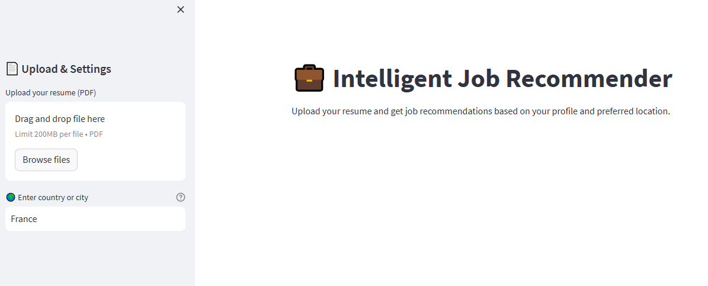

# Intelligent Job Recommender

An end-to-end machine learning & NLP project that analyzes resumes (PDF) to predict the candidate's job category, then dynamically scrapes LinkedIn to recommend real job openings based on the detected profile and desired location.
✨ Features

✅ Resume Parsing & Cleaning:
Reads PDF resumes, cleans the text (URLs, special characters, emojis, etc.) using regex & NLTK.

✅ Profile Prediction:
Predicts the candidate's job profile (e.g. Data Scientist, Java Developer, Business Analyst) using a pre-trained TF-IDF + Scikit-learn classifier.

✅ Real-time Job Recommendations:
Scrapes LinkedIn to fetch relevant job openings based on the predicted profile and location specified by the user.

✅ Interactive Streamlit Interface:

    Upload your PDF resume.

    Choose your preferred country or city.

    See your predicted profile and matching job opportunities.

🖥️ Demo

⚙️ Tech Stack

    Python for all data processing & backend.

    NLTK for text cleaning and stopword management.

    Scikit-learn for TF-IDF vectorization and job category classification.

    BeautifulSoup & Requests for web scraping LinkedIn job listings.

    PyPDF2 for reading PDF resumes.

    Streamlit for the interactive user interface.

    Pandas for data handling and display.

📂 Model & Vectorizer

🚀 Usage

Run the Streamlit app: streamlit run app.py

Then:

    Upload your resume as a PDF.

    Type the country or city where you want to find jobs.

    Get your predicted profile and see matching job listings fetched live from LinkedIn.

🔍 Example Predicted Profiles

    Data Scientist

    Java Developer

    Business Analyst

    Python Developer

    DevOps Engineer
